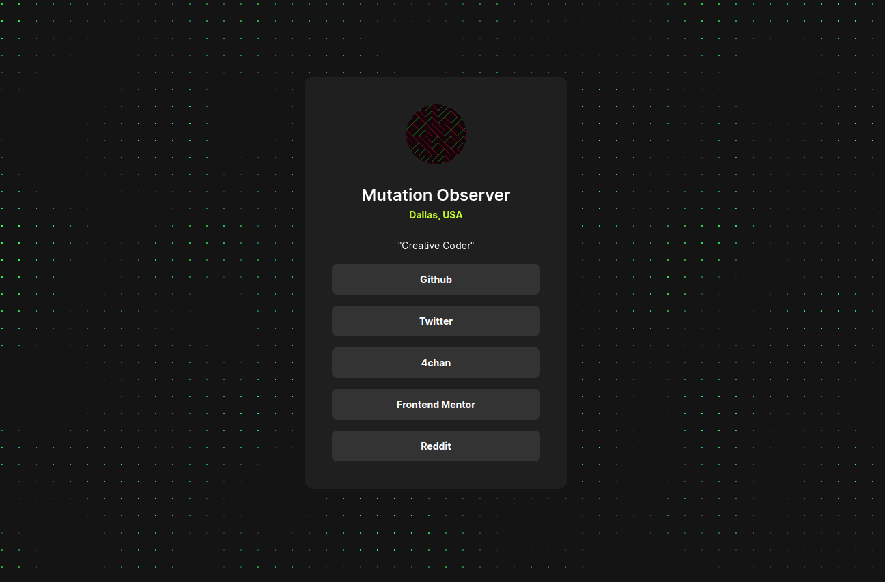

# Frontend Mentor - Social links profile solution

This is a solution to the [Social links profile challenge on Frontend Mentor](https://www.frontendmentor.io/challenges/social-links-profile-UG32l9m6dQ).

## Table of contents

- [Overview](#overview)
  - [The challenge](#the-challenge)
  - [Screenshot](#screenshot)
  - [Links](#links)
- [My process](#my-process)
  - [Built with](#built-with)
  - [Useful resources](#useful-resources)
- [Author](#author)

## Overview

### The challenge

Users should be able to:

- See hover and focus states for all interactive elements on the page

### Screenshot

### Links

- Solution URL: [Add solution URL here](https://your-solution-url.com)
- Live Site URL: [Add live site URL here](https://your-live-site-url.com)

- [Live](https://kxrn0.github.io/fem_socials)
- [Code](https://github.com/kxrn0/fem_socials)

## My process

### Built with

- CSS custom properties
- Flexbox
- [SolidJS](https://www.solidjs.com/) - JS library

### Useful resources

[The Nature of Code](https://natureofcode.com)

## Author

- Frontend Mentor - [@kxrn0](https://www.frontendmentor.io/profile/kxrn0)
- Xhitter - [@alhazred999](https://twitter.com/alhazred999)
